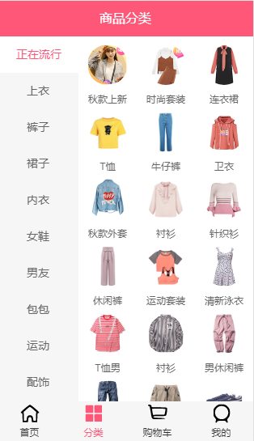
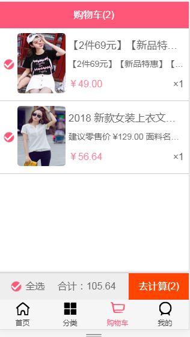
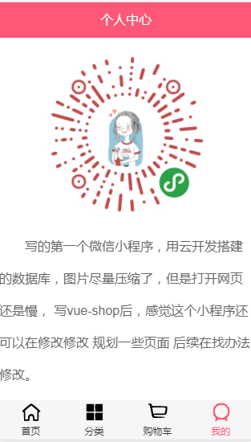

# vue-shop


-vue app项目 接口加 微信codewhy获取
-项目分四个页面（主页、详情、分类、购物车）

首页:    

     

商品:    

     

详情页:    

   

分类:   

   

购物车：    

   

我的：  



## Project setup
```
npm install
```

### Compiles and hot-reloads for development
```
npm run serve
```

### Compiles and minifies for production
```
npm run build
```

### Customize configuration
See [Configuration Reference](https://cli.vuejs.org/config/).
